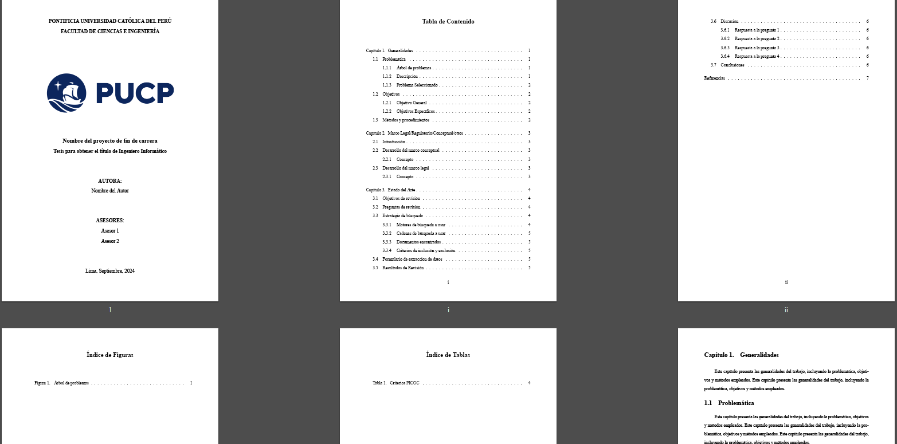

# Plantilla de Tesis PUCP en LaTeX

**Author:** María Rojas
Esta es una plantilla para trabajos de tesis de la PUCP, Ingeniería Informática, hecha en LaTeX.


## Herramientas usadas

1. **Editor de LaTeX:** [MiKTeX](https://miktex.org/) para Windows.
2. **Editor de código:** Visual Studio Code con las siguientes extensiones:
   - [LaTeX Workshop](https://marketplace.visualstudio.com/items?itemName=James-Yu.latex-workshop)
   - [LaTeX](https://marketplace.visualstudio.com/items?itemName=mathematic.vscode-latex)
3. **Compilador:** El compilador predeterminado es `xelatex` con `latexmk`

## Configuración en Visual Studio Code

Este proyecto está configurado para compilarse con `xelatex` utilizando `latexmk`. La configuración de compilación y las herramientas utilizadas están definidas en el archivo `settings.json`. La configuración relevante para la compilación es la siguiente (coloca los archivos temporales de compilación y el pdf generado en la carpeta `build/`):

```json
{
    "latex-workshop.latex.tools": [
        {
            "name": "xelatexmk",
            "command": "latexmk",
            "args": [
                "-synctex=1",
                "-interaction=nonstopmode",
                "-file-line-error",
                "-xelatex",
                "-outdir=%OUTDIR%",
                "%DOC%"
            ]
        }
    ],
    "latex-workshop.latex.recipes": [
        {
            "name": "xelatexmk",
            "tools": [
                "xelatexmk"
            ]
        }
    ],
    "latex-workshop.latex.recipe.default": "lastUsed",
    "latex-workshop.latex.recipe.defaultChoice": "xelatexmk",
    "latex-workshop.latex.outDir": "%DIR%/build"
}
